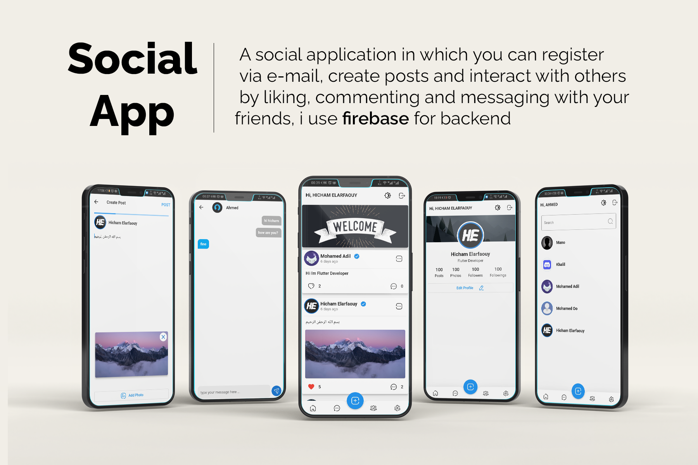
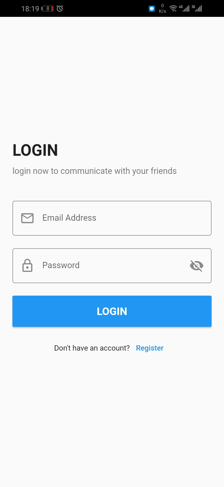
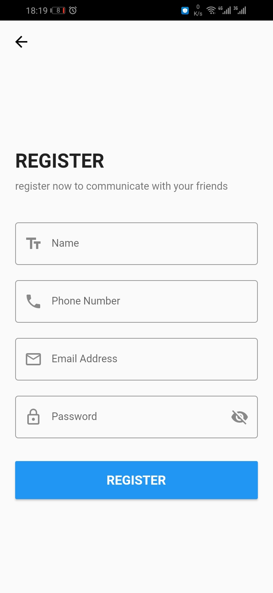
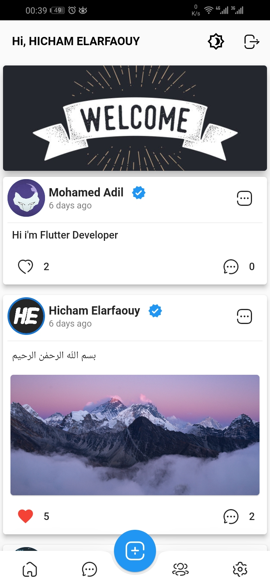
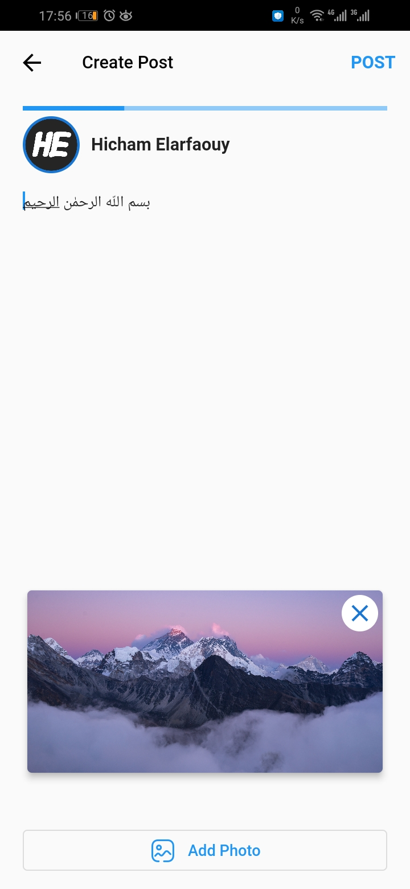
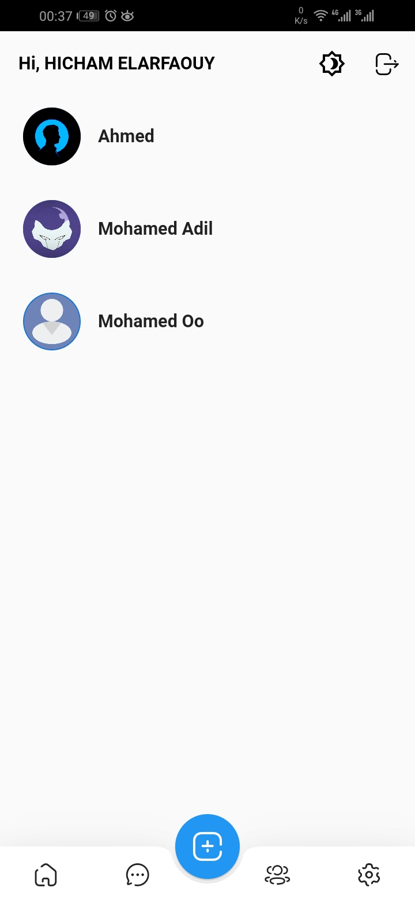
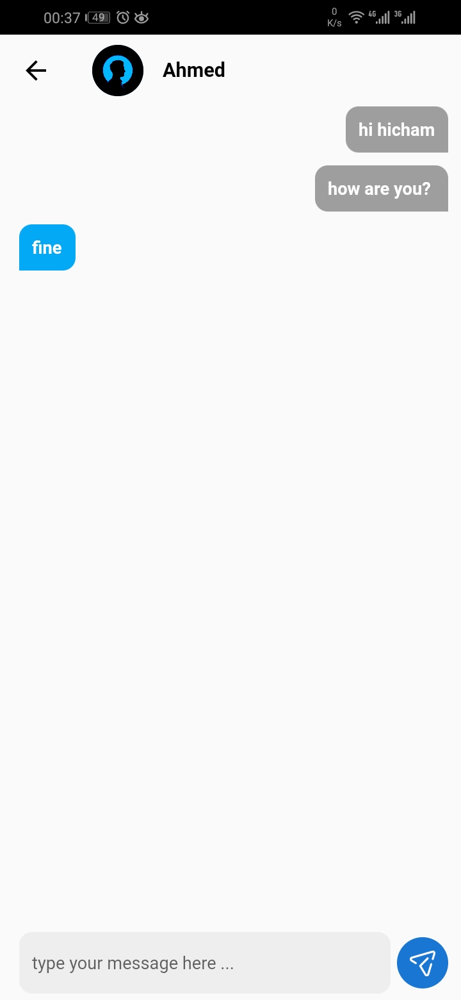
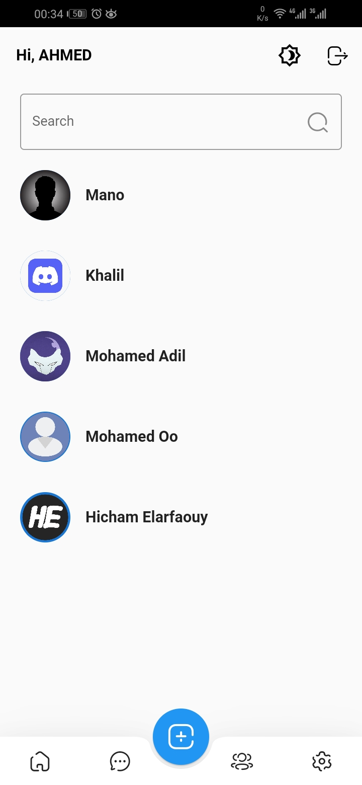
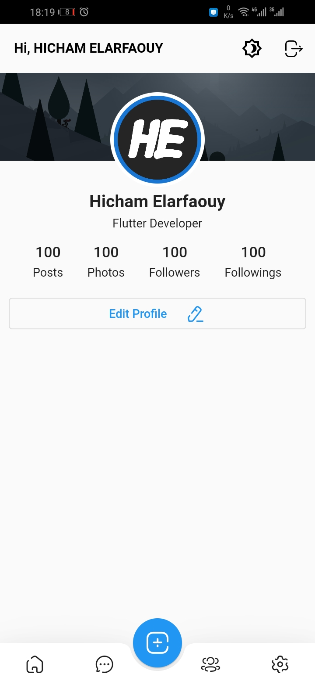

#  Social App ✨

Social is open-source  app for Android & ios with Firebase. It is built with Flutter Framework.

Star ⭐ the repo if you like it.

## Features

 - Login
 - Register
 - Create Posts
 - like & comment in Posts
 - Chat with friends
 - Search for friend
 - Edit profile & cover
 - Settings

## Snapshots 

| Login Screen | Register Screen|
|------|-------|
|||

| Home Page | Add Post|
|------|-------|
|||

| Chats Page | Chat|
|------|-------|
|||

| Users Page | Settings Page|
|------|-------|
|||

| Edit Profile |
|------|
||

## Dependencies 
 -  `bloc`
 -  `flutter_bloc`
 -  `fluttertoast`
 -  `shared_preferences`
 -  `image_picker`
 -  `firebase`

 ## My Social Media

